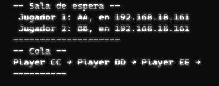
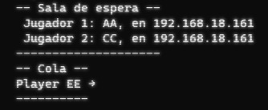

# Rilatria
Para comprensión detallada del funcionamiento del juego, leer la última versión del instructivo (Reglas del juego). Actualmente está en la versión v0.5.3.

## Sobre el desarrollo
Estamos construyendo un sistema temporal basado en PyQt para ver el funcionamiento de las mecánicas del juego. Posteriormente será trasladado a una aplicación web.

### Detalles mencionables
El juego se encuentra en la carpeta `CLIENT`, separada en 3 subcarpetas referidas al modo de funcionamiento del juego:
    - `unimode`: un juego basado únicamente en partidas locales, su objetivo es funcionar en un único dispositivo para que ambos jugadores "compartan mouse"
    - `multimode`: un juego basado en múltiples clientes y endpoints, hay un servidor que realiza las conexiones entre los jugadores y cada cliente se encarga únicamente de su representación local.
    - `old`: no está claro que es esto, una mezcla de ambas versiones, hecha anteriormente para ir probando cosas: se puede utilizar como respaldo para alguna funcionalidad que haya sido destruida accidentalmente, o como campo de juegos.
En la carpeta `Others` hay un directorio `playground` para escribir programas y probar funcionalidades sin compromiso de inserción en la versión final del juego.
 

**Conexión de jugadores en multimode**

Los juegos se lanzan desde la *Sala de espera* cada 5 segundos cuando hay dos jugadores en ella. Más jugadores conectados llevan a la creación de una *Cola de espera*, instancia donde se espera que la *Sala de espera* se vacíe. No hay límite para la cantidad de jugadores en cola. A medida que se vaya vaciando la *Sala de espera* la *Cola de espera* irá avanzando. La sala de espera está preparada para cualquier tipo de desconexión.

