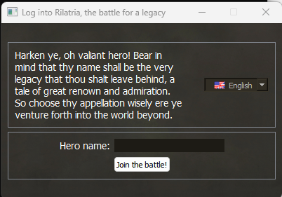
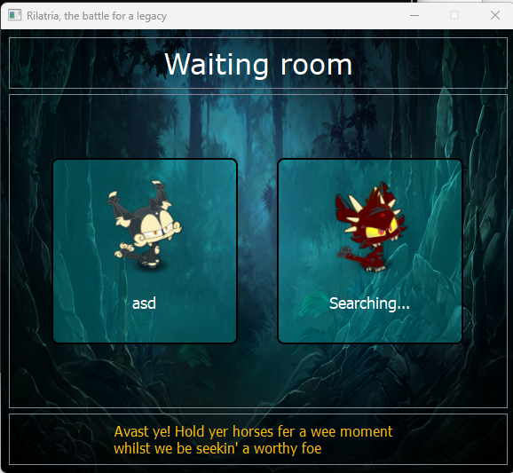
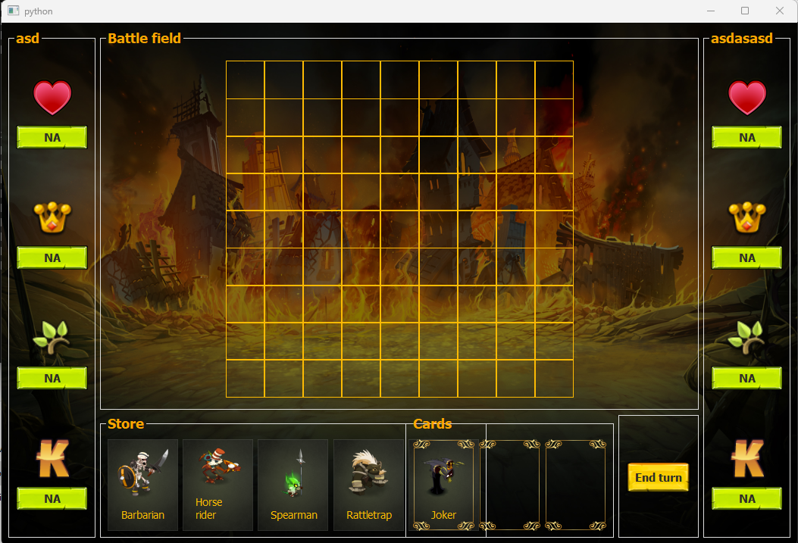

# Rilatria
Para comprensión detallada del funcionamiento del juego, leer la última versión del instructivo (Reglas del juego). Actualmente la versión redactada corresponde a la v0.5.3. Sin embargo, el juego puede estar adelantado respecto del instructivo ya que realizar cambios en el código base es más sencillo y experimental que crear un documento PDF para cada cambio.

## Sobre el desarrollo
Estamos construyendo un sistema temporal basado en PyQt para ver el funcionamiento de las mecánicas del juego. Posteriormente será trasladado a una aplicación web.

## Contenido
El cliente se compone de tres ventanas. La sala de ingreso para conectarse al servidor por medio de un nombre de usuario. La sala de espera, donde el usuario permanece mientras el servidor le asigna un oponente. Y la sala de juego, donde se lleva a cabo el combate.

