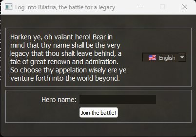
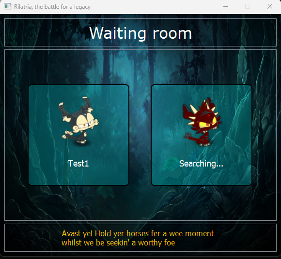
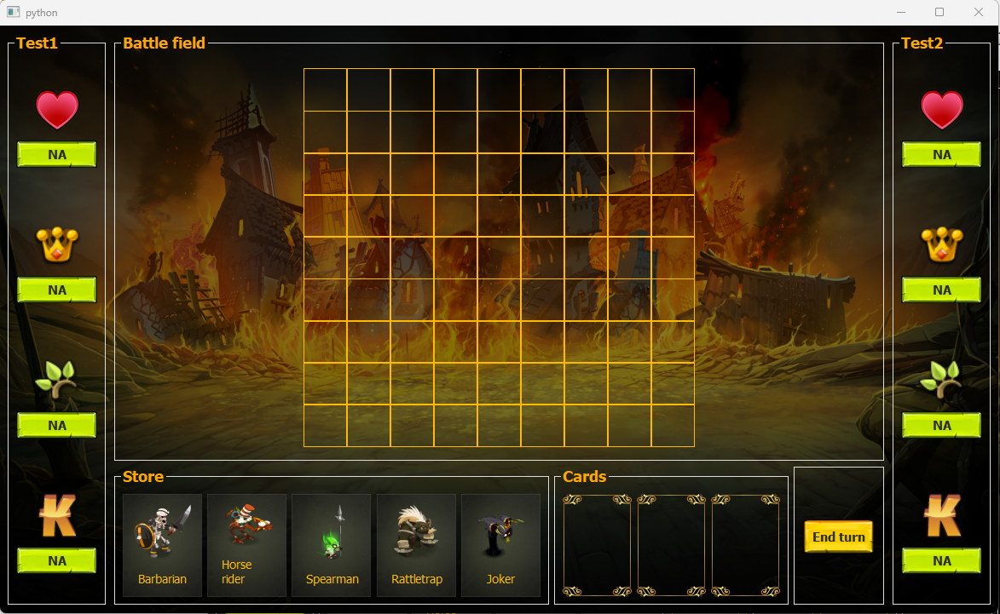

# Rilatria
Para comprensión detallada del funcionamiento del juego, leer la última versión del instructivo (Reglas del juego). Actualmente la versión redactada corresponde a la v0.5.3. Sin embargo, el juego puede estar adelantado respecto del instructivo ya que realizar cambios en el código base es más sencillo y experimental que crear un documento PDF para cada cambio.

## Sobre el desarrollo
Estamos construyendo un sistema temporal basado en PyQt para ver el funcionamiento de las mecánicas del juego. Posteriormente será trasladado a una aplicación web.

### Detalles mencionables
El juego se encuentra en la carpeta `CLIENT`, separada en 3 subcarpetas referidas al modo de funcionamiento del juego:

- `unimode`: un juego basado únicamente en partidas locales, su objetivo es funcionar en un único dispositivo para que ambos jugadores "compartan mouse"
- `multimode`: un juego basado en múltiples clientes y endpoints, hay un servidor que realiza las conexiones entre los jugadores y cada cliente se encarga únicamente de su representación local.
- `old`: no está claro que es esto, una mezcla de ambas versiones, hecha anteriormente para ir probando cosas: se puede utilizar como respaldo para alguna funcionalidad que haya sido destruida accidentalmente, o como campo de juegos.
En la carpeta `Others` hay un directorio `playground` para escribir programas y probar funcionalidades sin compromiso de inserción en la versión final del juego.

Es muy importante destacar que las imagenes y el arte utilizado actualmente no es de nuestra pertenencia.

## Contenido
El cliente se compone de tres ventanas. La sala de ingreso para conectarse al servidor por medio de un nombre de usuario. La sala de espera, donde el usuario permanece mientras el servidor le asigna un oponente. Y la sala de juego, donde se lleva a cabo el combate.

